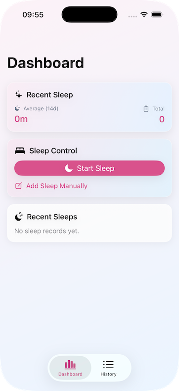
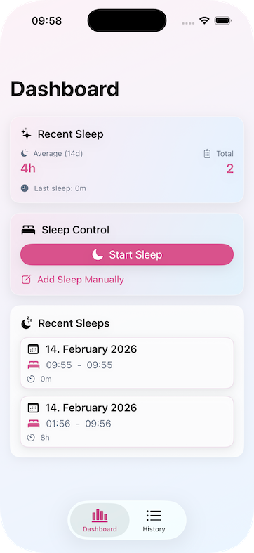
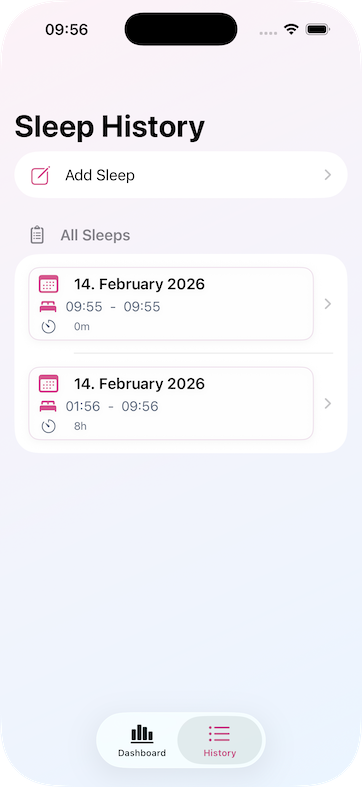
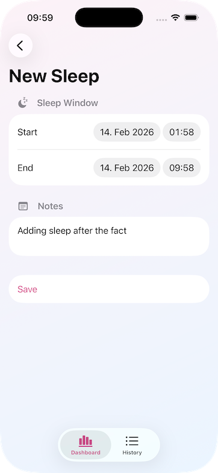
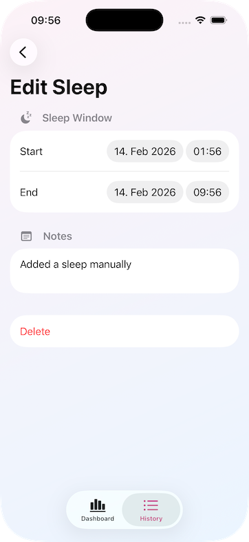
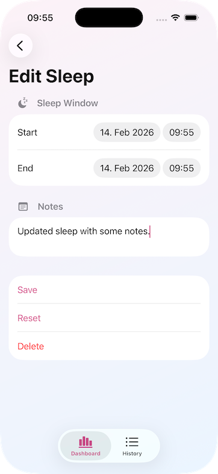

# SleepingTimer

SleepingTimer is an open-source SwiftUI sample project designed as a **handoff-ready scaffold** for other developers, teams, or companies.

The goal is not to ship a finished product here. The goal is to demonstrate a practical, scalable, and maintainable iOS project structure that can be extended into a production App Store app.

It is intentionally organized so junior developers can learn from it, and teams can adopt its architecture as a baseline for future work.

PRs that improve this scaffold for the community are welcome.

## Screenshots








## Project Intent

- Provide a clear SwiftUI architecture baseline for real teams.
- Keep responsibilities separated (UI, navigation, state, persistence).
- Make features easy to add without creating tight coupling.
- Encourage protocol-first dependency design for testability.
- Serve as a teaching project for junior and intermediate iOS developers.

## Tech Stack

- Swift 6
- SwiftUI
- Xcode project structure (no custom build tools required)
- Actor-based persistence store
- Async/await + AsyncStream for state updates

## Current Structure

```text
SleepingTimer/
  Components/   # Reusable UI elements used by multiple views
  Models/       # Domain models and route enums
  Scenes/       # Navigation roots (own NavigationStack + destinations)
  Services/     # Service container and app-level dependency access
  Stores/       # Persistence/state stores (protocol + concrete actor)
  ViewModels/   # Presentation/business logic for views/components
  Views/        # Screen/content UI
```

## Architecture Overview

### 1. Scene-Driven Navigation

`Scene` types are top-level navigation owners:

- `DashboardScene`
- `HistoryScene`

Each scene owns:

- A `NavigationStack`
- `.navigationDestination(for:)` mappings for its route enum

Why this matters:

- Navigation remains centralized and predictable.
- Child views/components can trigger route values without owning navigation infrastructure.

### 2. View / ViewModel Split

Views focus on:

- Rendering state
- User interaction wiring (`Button`, `NavigationLink`, etc.)

ViewModels focus on:

- Business logic
- Async workflows
- Error state
- Derived presentation state

This keeps SwiftUI views slim and easier to reason about.

### 3. Store Layer + Streaming State

`SleepStore` is an actor-backed persistence store.

It provides:

- CRUD-like operations for records
- `snapshotStream()` via `AsyncStream` for reactive updates
- Internal state normalization and persistence

Why this matters:

- Actor isolation improves concurrency safety.
- ViewModels can subscribe once and react to canonical snapshots.
- Mutating store state is serialized by the actor, which prevents common read/write data races.
- The actor boundary removes most manual synchronization concerns (for example locks or queue juggling).
- AsyncStream gives consumers a clean, ordered update channel without exposing mutable shared state.

Why `AsyncStream` over Combine in the store:

- The store is built around Swift Concurrency primitives (`actor`, `async/await`, `AsyncStream`) for a single concurrency model end-to-end.
- `AsyncStream` integrates naturally with `for await` consumption in async tasks used by view models.
- No Combine dependency is required in the persistence/store layer.
- Thread safety responsibilities are split clearly:
  - The actor protects mutable store state.
  - `AsyncStream` safely coordinates asynchronous value delivery from producer to consumers.

### 4. Protocol-Based Dependency Injection

Dependencies are referenced through protocols:

- `ServiceContainerProtocol`
- `SleepStoreProtocol`
- `SleepStoreStorageURLProviding`

Concrete implementations are injected at the composition root (`SleepingTimerApp`).

Why protocol-first helps testing:

- Swap real stores for test doubles/stubs.
- Verify behavior without file system coupling.
- Test failure paths deterministically.

Future Swift evolution note (existentials):

- This project currently keeps dependency usage straightforward and protocol-driven.
- As the codebase evolves, teams may choose to adopt explicit existential typing with `any` (for example `any SleepStoreProtocol`) to make existential usage intentional and compiler-checked.
- Using `any` can improve API clarity by signaling dynamic dispatch and existential storage at call sites.
- Keep in mind that existential-based APIs can have different performance and abstraction tradeoffs than fully concrete or generic alternatives.
- Recommended approach: introduce `any` gradually at dependency boundaries where existential behavior is desired, and keep hot paths measured and concrete where needed.

## Why Views/Scenes/Services Live Where They Live

- `Views/`: concrete UI surfaces for feature flows.
- `Scenes/`: navigation ownership to prevent scattered destination logic.
- `Components/`: cross-screen UI building blocks.
- `ViewModels/`: per-view/component state orchestration and side effects.
- `Stores/`: long-lived state + persistence concerns.
- `Services/`: app-level dependency composition boundary.

This separation helps teams scale feature work without stepping on each other’s code.

## Data Flow

1. User performs action in `View` / `Component`.
2. View forwards action to `ViewModel`.
3. ViewModel calls `SleepStoreProtocol` methods.
4. Store mutates actor state and emits updated snapshot.
5. ViewModels subscribed to stream update published properties.
6. SwiftUI re-renders affected views.

## How to Add a New Feature

Example workflow:

1. Add/extend domain models in `Models/`.
2. Add store methods to `SleepStoreProtocol` and implement in `SleepStore`.
3. Build or update a ViewModel in `ViewModels/` for feature logic.
4. Create/update UI in `Views/` and reusable UI in `Components/`.
5. Add route enum case(s) and destination handling in the owning `Scene`.
6. Inject dependencies through `ServiceContainerProtocol` instead of constructing ad-hoc dependencies in views.
7. Add tests for ViewModel/store behavior (recommended before PR merge).

## Persistence and Testability Notes

`SleepStore` now accepts an injectable storage URL provider:

- `SleepStoreStorageURLProviding`
- `DefaultSleepStoreStorageURLProvider`

This enables tests to point persistence to temporary locations without changing production logic.

## Build

From project root:

```bash
xcodebuild -project SleepingTimer.xcodeproj -scheme SleepingTimer -destination 'platform=iOS Simulator,name=iPhone 17 Pro' build
```

Or open `SleepingTimer.xcodeproj` in Xcode and run the `SleepingTimer` scheme.

## Suggested Next Steps for Production Readiness

- Add comprehensive unit tests for stores and view models.
- Introduce CI (build + lint + tests).
- Add structured logging and analytics hooks.
- Add app settings (for user preferences and feature toggles).
- Add accessibility audits and localization support.
- Add App Store-ready metadata, privacy details, and release process docs.

## Contributing

Contributions are welcome.

If you want to extend this scaffold for others:

1. Fork the repo.
2. Create a feature branch.
3. Keep architecture boundaries intact.
4. Submit a PR with clear rationale and testing notes.

Please prefer small, focused PRs that are easy to review.

## Audience

This repository is especially useful for:

- Junior iOS developers learning scalable project structure.
- Companies seeking a starter architecture for SwiftUI apps.
- Teams who want a pragmatic, protocol-driven baseline they can evolve.

---

If you adopt this project as a base for your own app, feel free to tailor naming, modules, and CI policy to your organization’s standards.
